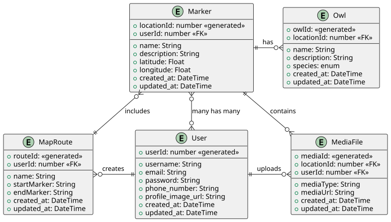

# OwlMap API
REST API backend for the OwlMap project.

### How this API is mapped



### Install and run this api

* clone this repository:

```bash
git clone https://github.com/inatagan/owlmapapi.git
```

* from the root dir navigate to the API dir with:

```bash
cd owlmap-java/
```

* run the API:

```bash
mvn spring-boot:run
```

### Endpoints provided

You can see full documentation and endpoints on the swagger page like this example:
```
http://localhost:8081/swagger-ui/index.html
```

```
/owlmap
```

```
/owlmap/users
```

```
/owlmap/markers
```

https://docs.google.com/presentation/d/1PXD4l1uJI6hr-5ITNHKOED0hNUztKRisUa3wb8BUS9U/edit?usp=sharing